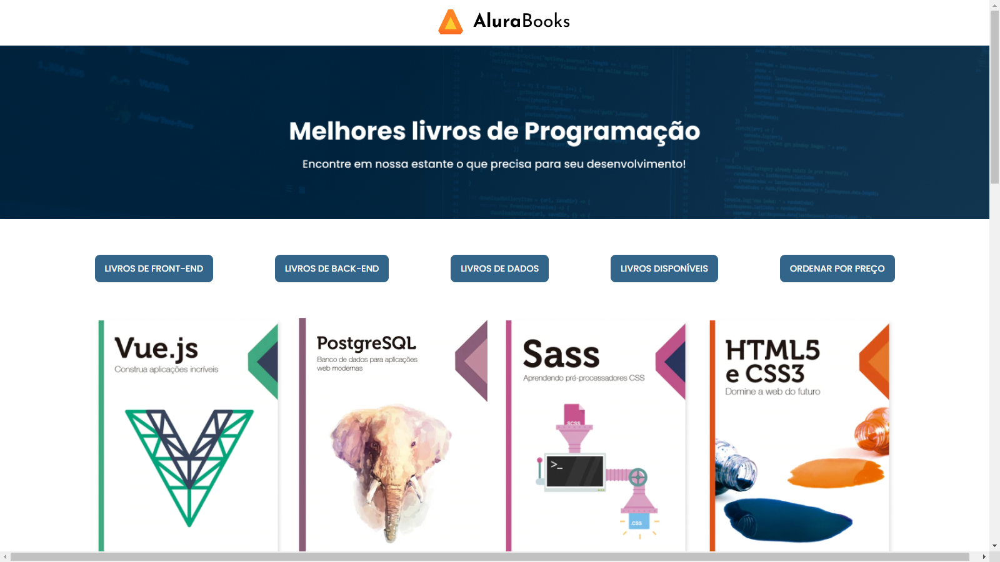

## Desafios: Exercícios
#### Projeto : alura-books-pi
#### Data : 27/12/2024

#### Formação
[Formação desenvolvimento front-end: cursos para criar aplicações web com HTML, CSS e JavaScript](https://cursos.alura.com.br/formacao-javascript-front-end);

#### Curso
[Curso de JavaScript: métodos de array](https://cursos.alura.com.br/course/javascript-metodos-array)

